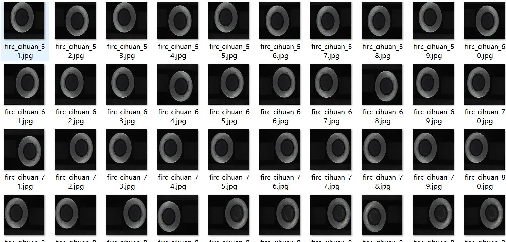
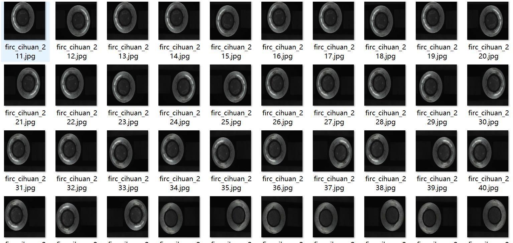
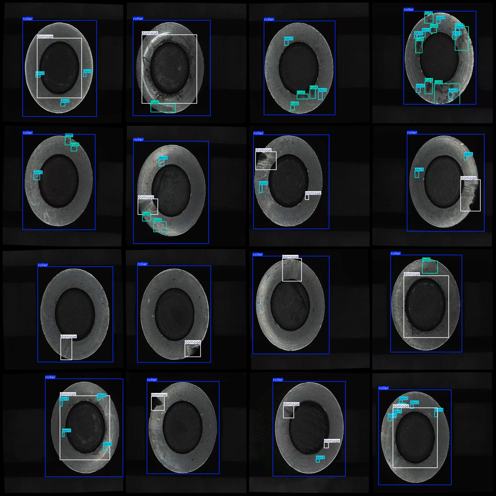
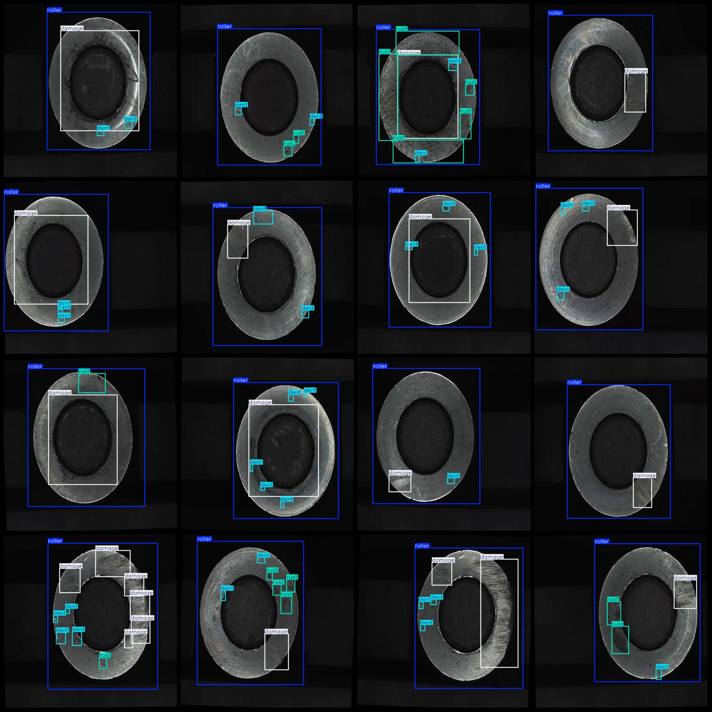

# Industrial Magnetic Ring Surface Defect Detection Data Set (VOC+YOLO Format) with 2907 Images in 4 Categories

Dataset Format: Pascal VOC format + YOLO format (txt files without split paths, only containing jpeg images and corresponding VOC format xml files and YOLO format txt files).
Number of Images (JPG Files): 2907
Number of Annotations (XML Files): 2907
Number of Annotations (Txt Files): 2907
Number of Annotation Categories: 4
Annotation Category Names (Note that the order of categories in the YOLO format does not correspond to this, but is based on the labels folder "classes.txt"): ["Damaged", "Deformed", "Rolling", "Rust"]
Number of Boxes per Category:
Damaged = 3218
Deformed = 5997
Rolling = 2614
Rust = 2355
Total Boxes = 14184
Image Resolution: 640x640
Annotation Tool Used: labelImg
Annotation Rules: Draw boxes around categories
Important Notice: There are no guarantees regarding the accuracy of the trained models or weight files.
Picture Preview:
Annotation Example:

## Images

Here is a pay link on Stripe ( https://buy.stripe.com/3cs8yP7sY87d0vu9AB ). Please contact me lonlonago@foxmail.com after funding $89, and I will send you a complete data files , thank you!

